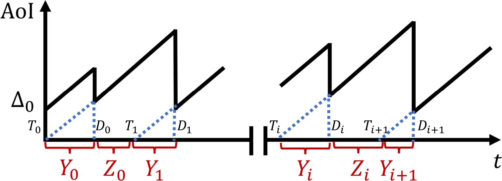

# AoI-MDP

This is the code of the AoI-MDP based SAC algorithm for multiple AUVs-assisted IoUT data collection task.

## Version Information

The versions of the code usage library are listed below:

|  Library   | Version |
| :--------: | :-----: |
|   numpy    | 1.24.3  |
|    gym     | 0.26.2  |
| matplotlib |  3.7.5  |

Torch version for the code is 2.2.2 with Python 3.8.19.

## Code Function Description

The code function descriptions are listed as follows:

```python
 train_masac_2.py # file for training the framework
```

```python
 env.py # file for environment settings
```

```python
 dist_ang_estimate.py # file for statistical signal processing modeling
```

```python
masac.py # file for SAC algorithm
```

## Running Experiments

*****

- To train the model:  
    ```python
    python train_masac_2.py
    ```

****

## Overview



This paper presents an Age of Information optimized Markov Decision Process (AoI-MDP) tailored for underwater tasks involving Autonomous Underwater Vehicles (AUVs). Recognizing the challenges posed by observation delays due to acoustic communication in the Internet of Underwater Things (IoUT), this study aims to enhance the information freshness, thereby improving decision-making efficiency in underwater environments.

The proposed AoI-MDP integrates observation delay into the state space and introduces a wait time in the action space. By leveraging Reinforcement Learning (RL) for training, the model achieves joint optimization of information freshness and decision-making processes. High-precision modeling is attained through Statistical Signal Processing (SSP), which represents observation delay as an underwater acoustic signal delay.

Simulation results underscore the feasibility and effectiveness of the AoI-MDP approach. It demonstrates superior performance in minimizing AoI, optimizing sum data rate, and reducing energy consumption in a multi-AUV data collection task scenario. The contributions of this work include the novel formulation of underwater tasks as an MDP that incorporates AoI and observation delay, as well as the integration of RL to optimize these parameters.

## Citation

If you find our work useful, please kindly cite:

```
@article{ding2024aoimdp,
      title={Enhancing Information Freshness: An AoI Optimized Markov Decision Process Dedicated In the Underwater Task}, 
      author={Yimian Ding and Jingzehua Xu and Yiyuan Yang and Shuai Zhang},
      journal={arXiv preprint arXiv:2024.02424},
  	  year={2024}
}
```

## Copyright Notice

This code is available as free and open-source software for research purposes only. Unauthorized commercial use is strictly prohibited. If you utilize this code in your work, please provide proper attribution in your publication.